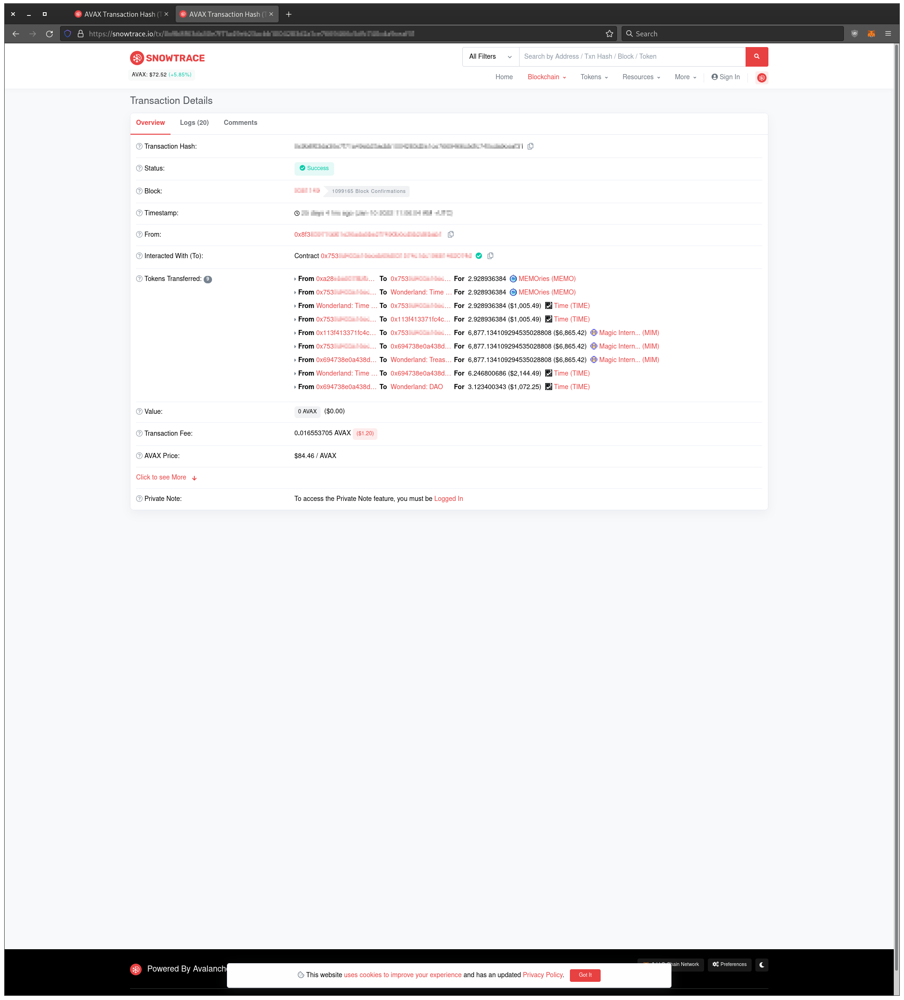

# Wonderland (Olympus Pro fork) - Atomic Bonding
A tool for purchasing and redeeming Wonderland bonds atomically.\
\
Notes:\
Wonderland bonding is deprecated.\
For educational purposes only.

## Background
### Purchasing bond
1. Swap $TIME to $MIM
2. Bond $TIME with $MIM

### Redeeming bond
1. Redeem $TIME

## Issue (purchasing bond)
1. Pair & bond price actions in two transactions.
2. Non-optimal ROI without pair & bond prices monitoring.

## Solution
1. Swap & bond actions in one transactions.
2. Pair & bond prices monitoring with on-chain data, slippage & fees inclusive.
3. Safe to invoke redeem() with untrusted accounts.

## Example (purchasing bond)
